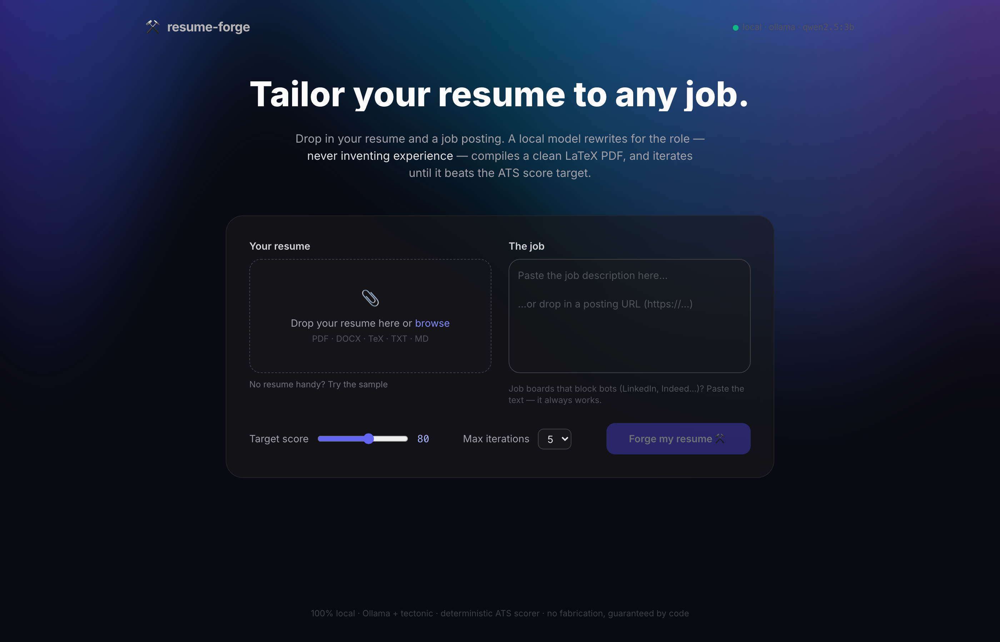

# resume-forge

Given a job posting (URL or pasted text) and your existing resume, **resume-forge** produces an
ATS-optimized, LaTeX-generated **one-page** PDF resume tailored to that job, iterating against a
**local ATS scorer** until it scores ≥ 80 (configurable), and returns the PDF plus a JSON score
report — optionally with a matching **cover letter** grounded in the same no-fabrication rules.

Runs on a **free cloud model** (z.ai/GLM, Gemini, Groq — seconds per call) or **fully local**
(Ollama, no key). Any OpenAI-compatible endpoint works, so it drops into your other projects too.



Four layers, all in this repo:

1. **`resume_forge`** — a core Python package with a clean programmatic API
2. **Web app** — FastAPI backend + React frontend (upload, live progress, animated score report)
3. **MCP server** — exposes the pipeline as tools so agents/Claude can call it
4. **CLI** — `resume-forge --job <url|-> --resume <path> --out <dir>`

**No fabrication, by design.** Tailoring = emphasis + rewording + keyword alignment. The tailoring
prompt forbids inventing employers, titles, dates, degrees, certifications, or metrics — and a
programmatic guard (`enforce_no_fabrication`) drops any employer/school/project/certification that
doesn't exist in your master resume, and always restores your real contact info.

## Setup

Requirements: Python 3.11+, [`uv`](https://docs.astral.sh/uv/), and a LaTeX engine —
[`tectonic`](https://tectonic-typesetting.github.io/) preferred (single binary, fetches packages on
demand), `pdflatex` as fallback.

```bash
brew install tectonic          # macOS; see tectonic's docs for other platforms
git clone https://github.com/vishalVasanthakumarPoornima/Resume-Tailor-ATS-Scorer.git
cd Resume-Tailor-ATS-Scorer
uv sync

# optional: headless-browser fallback for JS-heavy job pages
uv sync --extra browser && uv run playwright install chromium
```

### Pick a model backend

**Fastest — a free cloud model (recommended).** Grab one free API key, drop it in a `.env` file
(or export it), and resume-forge auto-detects it. Seconds per call, nothing to run locally:

| Provider | Get a free key | Env var | Default model |
|---|---|---|---|
| **z.ai (GLM)** | sign in at z.ai, then https://z.ai/manage-apikey/apikey-list | `ZAI_API_KEY` | `glm-4.5-flash` |
| **Google Gemini** | https://aistudio.google.com/apikey | `GEMINI_API_KEY` | `gemini-2.5-flash` |
| **Groq** | https://console.groq.com/keys | `GROQ_API_KEY` | `llama-3.3-70b-versatile` |

```bash
cp .env.example .env      # then paste ONE key into it — that's it
```

Any OpenAI-compatible endpoint also works via `--backend openai` with `RESUME_FORGE_OPENAI_BASE_URL`
+ `RESUME_FORGE_MODEL` (+ `RESUME_FORGE_API_KEY` if it needs auth — a keyless/self-hosted endpoint
works without one). OpenRouter and Cerebras have presets too.

**Fully local — Ollama, no API key.** Used automatically when no cloud key is set:

```bash
brew install ollama && ollama pull qwen2.5:3b   # auto-detected; light + fast
```

The LLM steps (resume/JD parsing, tailoring) request schema-constrained JSON validated by Pydantic;
scoring is deterministic Python. Because small local models can be sloppy, the pipeline adds
deterministic guardrails:

- every schema property is forced `required` for Ollama's grammar decoding, so a resume whose
  sections are ordered differently than the schema can't get silently truncated;
- an empty parse of a non-trivial resume is retried, then escalated to the strongest installed
  model (`RESUME_FORGE_INGEST_MODEL` to override), then rejected loudly — never accepted;
- contact info is regex-recovered from the raw resume if the model drops it;
- tailoring can never delete your history: employers/education the model omits are restored from
  the master profile (fuzzy-matched, so cosmetic name drift isn't treated as fabrication), and any
  JD skill that exists in your profile is backfilled if trimmed. Skills, employers, degrees, and
  certifications *not* in your profile are never added.

Backend selection: a present cloud key wins, else local Ollama. Force it with
`RESUME_FORGE_LLM_BACKEND` (`zai | glm | gemini | groq | openrouter | cerebras | openai | ollama |
anthropic`) or `--backend`; pick the model with `RESUME_FORGE_MODEL` or `--model`. See `.env.example`.

### Always one page

Every resume is fitted to a **single page**: the renderer compiles at progressively compact spacing
(10pt → 9pt, tighter margins) and picks the first setting that fits. Only if a resume still overflows
at the tightest setting does it trim the lowest-priority content — extra bullets, then trailing
projects — **never** an employer, degree, or contact detail, so it can shorten without leaving gaps.

## Web app

```bash
# terminal 1 — backend (FastAPI on :8756)
uv run resume-forge-server --port 8756

# terminal 2 — frontend (Vite dev server on :5173, proxies /api to the backend)
cd frontend && npm install && npm run dev
```

Open http://localhost:5173: drag in your resume (or click "Try the sample"), paste a JD or
posting URL, set the target score, tick **Cover letter** if you want one, and hit **Forge**. You
get a live progress stepper while the pipeline runs, then an animated score dial, per-dimension
breakdown, missing-keyword chips, and one-click downloads (resume PDF, cover letter, .tex,
report.json). The UI uses [React Bits](https://reactbits.dev) components (Aurora + Particles
backgrounds, SplitText, ShinyText, GradientText, SpotlightCard, StarBorder, AnimatedContent,
CountUp) over Tailwind.

**Cover letters** follow the same grounding contract as tailoring: the model writes body
paragraphs only (salutation, date, and signature come from verified data), bracketed placeholders
and stray sign-offs are stripped, and every claim must come from your master profile.

If the backend runs on a different port: `BACKEND_PORT=<port> npm run dev`.

**Production mode (single command):** build the frontend once and the backend serves it directly —

```bash
cd frontend && npm install && npm run build && cd ..
uv run resume-forge-server --port 8756   # whole app at http://127.0.0.1:8756
```

## CLI

```bash
# From a job posting URL
uv run resume-forge --job "https://boards.greenhouse.io/acme/jobs/123" \
    --resume ~/Documents/resume.pdf --out output/

# From pasted JD text on stdin (most reliable — see "Scraping & ToS" below)
pbpaste | uv run resume-forge --job - --resume ~/Documents/resume.pdf --out output/

# URL with a text-file fallback in case the fetch fails
uv run resume-forge --job "https://..." --job-text jd.txt --resume resume.pdf

# Options
#   --target 80           target ATS score (default 80)
#   --max-iterations 5    cap on tailor→score rounds (default 5)
#   --cover-letter        also generate a matching cover letter PDF
#   --backend ollama      LLM backend: ollama (default) or anthropic
#   --model <id>          model for the backend (e.g. llama3.1:8b or claude-opus-4-8)
#   --no-browser          skip the headless-browser fallback for JS-heavy pages
#   --no-cache            re-parse the master resume, ignoring the cache
```

Outputs in `--out`: `resume_tailored.pdf`, `resume_tailored.tex`, `score_report.json`, plus
per-iteration `resume_iterN.{tex,pdf}` for inspection.

## Python API

```python
from resume_forge import forge

result = forge(
    "https://boards.greenhouse.io/acme/jobs/123",   # or the pasted JD text
    "~/Documents/resume.pdf",
    "output/",
    target_score=80,
)
print(result.report.score, result.report.missing_keywords)
print(result.pdf_path)
```

Or compose the pipeline steps yourself — each is independently importable and testable:

```python
from resume_forge import (
    ingest_master_resume,   # 1. resume file -> MasterProfile (cached as JSON)
    extract_job,            # 2. URL/text -> Job {title, required_skills, keywords, ...}
    tailor,                 # 3. (profile, job) -> TailoredResume  (no fabrication)
    render_tex,             # 4. TailoredResume -> .tex (LaTeX specials escaped)
    compile_pdf,            # 5. .tex -> .pdf via tectonic/pdflatex
    score_ats,              # 6. (pdf, job) -> ScoreReport {score, subscores, missing_keywords}
    optimize,               # 7. loop 3-6 until target score or max iterations
)

profile = ingest_master_resume("resume.pdf")
job = extract_job("https://...", job_description_text=open("jd.txt").read())
result = optimize(profile, job, "output/", target_score=80, max_iterations=5)
```

## MCP server

The server exposes: `tailor_resume` (full pipeline), `extract_job_posting`, `score_resume`
(score any existing PDF against a JD), and `ingest_resume`.

Register with Claude Code:

```bash
claude mcp add resume-forge -- uv run --directory /path/to/Resume-Tailor-ATS-Scorer resume-forge-mcp
```

Or in any MCP client config (stdio transport):

```json
{
  "mcpServers": {
    "resume-forge": {
      "command": "uv",
      "args": ["run", "--directory", "/path/to/Resume-Tailor-ATS-Scorer", "resume-forge-mcp"]
    }
  }
}
```

(Uses your local Ollama by default. To use Anthropic instead, add
`"env": {"RESUME_FORGE_LLM_BACKEND": "anthropic", "ANTHROPIC_API_KEY": "sk-ant-..."}`.)

Example agent usage: *"Tailor `~/resume.pdf` to this posting: <paste JD>"* → the agent calls
`tailor_resume(job_url_or_text=..., master_resume_path=...)` and gets back the PDF path and report.

## ATS scoring (local, deterministic)

| Dimension     | Weight | What it measures |
|---------------|-------:|------------------|
| keywords      | 40 | JD skill/keyword coverage (required skills weigh 2×) |
| parseability  | 15 | clean text extraction from the PDF (no `(cid:)` junk, enough text/page) |
| sections      | 15 | standard Experience / Education / Skills headers |
| bullets       | 15 | action-verb starts + quantified results |
| contact       | 10 | detectable email + phone |
| length        |  5 | 1–2 pages, reasonable word count |

Report shape: `{score, subscores, max_subscores, missing_keywords, suggestions}`.
`missing_keywords` and the weakest subscores are fed back into the tailoring prompt on each
optimize iteration — while still respecting the no-fabrication rule, so keywords your profile
can't truthfully support will remain missing (the report's `notes` call this out).

## Fetching job postings: fallback chain, scraping & ToS

For URLs the fetch chain is: **plain HTTP GET → headless browser (Playwright, if the `browser`
extra is installed) → pasted JD text**. The Playwright path exists for legitimately public but
JS-rendered pages (many company career sites render the JD client-side).

Many job boards (**LinkedIn, Indeed, Glassdoor**, and others) **prohibit automated scraping in
their ToS** and actively block bots. resume-forge does a single polite fetch per attempt — no
login automation, no CAPTCHA/bot-wall evasion, no retry hammering — so for those sites expect
fetching to fail even with the browser fallback. The supported path there is to **paste the JD
text** (`--job -` on stdin, `--job-text file`, or `job_description_text` in the API/MCP tools).
Direct company career pages (Greenhouse, Lever, Ashby) usually fetch fine.

## Development

```bash
uv run pytest            # scorer logic, LaTeX escaping, JD-fallback path, no-fabrication guard,
                         # optimize loop, ingest caching — all with mocked LLM + network
```

Layout:

```
src/resume_forge/
  models.py        # Pydantic models (MasterProfile, Job, TailoredResume, ScoreReport, ...)
  llm.py           # LLM backends: Ollama (default, schema-constrained JSON) + Anthropic (opt-in)
  ingest.py        # step 1: resume file -> MasterProfile, cached; regex contact backfill
  jobs.py          # step 2: URL/text -> Job (httpx -> Playwright -> pasted-text fallback)
  tailor.py        # step 3: tailoring + no-fabrication guard + truthful-skill backfill
  cover.py         # optional: grounded cover letter (write -> render -> compile)
  latex.py         # steps 4-5: escaping, Jinja template rendering, tectonic/pdflatex
  ats.py           # step 6: local scorer
  pipeline.py      # steps 7-8: optimize loop + forge() entry point
  cli.py           # CLI
  mcp_server.py    # MCP server (FastMCP, stdio)
  server.py        # FastAPI backend for the web app (background jobs + progress polling)
  templates/resume.tex.j2   # ATS-friendly template: single column, no graphics/tables
frontend/          # React + Vite + Tailwind web UI (React Bits components in src/blocks/)
tests/             # pytest suite, fully offline
```
